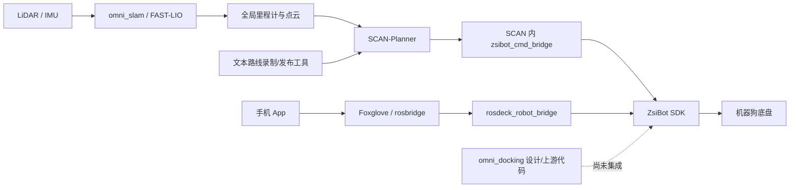
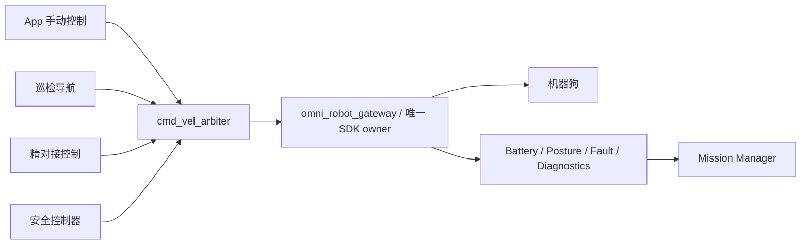
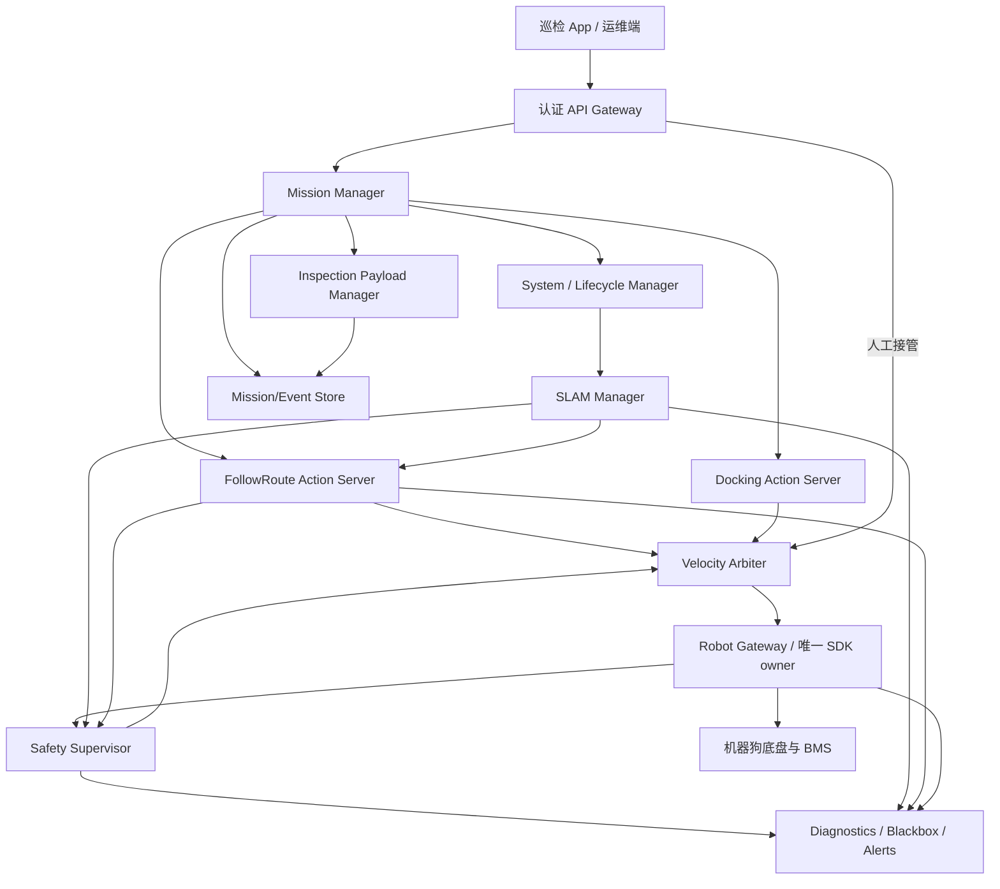
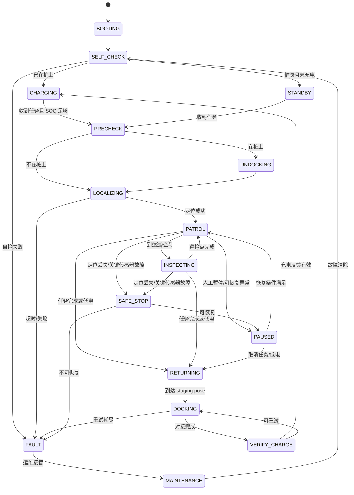

# 巡检机器狗项目工程化分析与实施 TODO

> 分析日期：2026-08-11  
> 审查范围：`omni_slam`、`omni_slam/tools/global_path_tools`、`SCAN-Planner`、`rosdeck` 手机 App、`rosdeck_robot_bridge`、`omni_docking`  
> 结论依据：当前工作区源码、启动文件、配置、部署脚本、现有测试与设计文档。本文是代码与架构审查，不等同于实机安全认证。

## 1. 结论先行

当前系统已经具备“受控环境下完成导航演示”的主要算法链路，但还不是可无人值守运行的巡检产品。更准确地说，它目前处于：

```text
算法 Demo  →  可重复联调样机  →  单场地试点  →  无人值守产品
               ↑ 当前大致位置
```

已有基础并不差：

- `SCAN-Planner` 已经有里程计超时停车、规划器心跳、轨迹身份校验、碰撞检查、重规划和一批控制器单元测试；
- SLAM 已经有建图/重定位配置、地图保存服务、全局坐标输出以及 Orin 部署脚本；
- App 已经有 Foxglove/rosbridge 通信、控制权租约、断线重连和较完整的 UI/通信单测；
- 路径工具已经处理了坐标系、机体/雷达外参、路径简化、起点距离检查；
- 回充设计文档已经意识到 Mission Manager、低电量返航和任务生命周期的重要性。

但距离产品化还有四个决定性缺口：

1. **没有全局 Mission Manager。** 每个模块有自己的局部状态，但没有一个组件对“整台机器人现在在做什么、为什么能动、失败后怎么办”负责。
2. **运动控制没有唯一出口。** `SCAN-Planner/zsibot_cmd_bridge` 和 App Bridge 都可能接触厂商 SDK；手动、巡检、回充也没有统一仲裁。这个问题必须先于功能扩展解决。
3. **SLAM、路径、规划器只有技术接口，没有产品契约。** 缺少带任务 ID、反馈、取消、超时、错误码和持久化恢复的 Action/状态接口。
4. **安全、可观测、部署、安全通信和验证体系不完整。** 当前可以靠人观察终端和手工重启恢复，产品必须依靠状态、告警、看门狗、日志和自动恢复。

综合成熟度可粗略判断为 **35% 左右**。这里不是按代码量计算，而是按“能否长期、无人、可诊断地完成巡检任务”计算。

| 维度 | 当前判断 | 说明 |
| --- | --- | --- |
| SLAM 算法可用性 | 中 | 能建图/重定位，但生命周期和质量状态不足 |
| 局部规划与控制 | 中上 | 已有较多真机安全加固，是当前最成熟部分 |
| 路线/任务管理 | 低 | 路线仍以文本文件和一次性 topic 发布为主 |
| 机器人任务状态机 | 很低 | 尚无真正实现的 Mission Manager |
| 底盘控制安全 | 低 | 多控制源、双 Bridge、缺少完整仲裁与末端 watchdog |
| 自动回充 | 很低 | 目前主要是设计文档和上游依赖，未形成自研运行包 |
| App 产品能力 | 中低 | 通用 ROS 控制台较成熟，巡检业务能力基本未实现 |
| 部署与升级 | 中低 | 部分 systemd/打包已存在，但跨仓版本和环境未统一 |
| 测试与可靠性 | 中低 | App/Planner 有单测，跨模块、实机故障注入和长稳测试缺失 |
| 安全与权限 | 很低 | 明文 WebSocket、全 ROS 图暴露、无用户鉴权/RBAC/审计 |

## 2. 当前实际链路

当前主要数据流可以概括为：



主要问题不在某一个算法，而在模块边界：

- SLAM、规划器、App 都能各自运行，但没有统一启动顺序和 readiness gate；
- 路线发布只表达几何点，不表达巡检点动作和任务语义；
- App Bridge 主要面向手动控制，Planner Bridge 主要面向自动导航；
- 回充设计假定存在 Mission Manager、`/battery_state` 和 Dock Actions，但当前代码中这些前置能力并不存在；
- 同一台机器人上的 ROS Domain、RMW、SDK 版本和外参配置没有单一事实来源。

## 3. 必须优先处理的 P0 问题

### P0-1：两个 Bridge 会争用厂商 SDK，且没有统一控制仲裁

证据：

- `SCAN-Planner/src/zsibot_cmd_bridge/src/zsibot_cmd_bridge.cpp` 在节点构造时直接 `initRobot()`，默认还会自动站立；
- `rosdeck_robot_bridge/src/zsibot_adapter.cpp` 也会在 App 获取控制权后创建厂商 HighLevel SDK；
- Planner 默认输出 `/scan_planner/cmd_vel`，App 默认输出 `/vel_cmd`，两条链路彼此隔离但都可能到达机器人；
- `omni_docking` 后续还会增加第三个速度来源。

风险：

- 两个 SDK client 同时占用控制通道；
- 自动巡检和 App 手柄互相覆盖；
- 任务结束、App 断线或节点重启后，无法证明最后一条非零速度一定被撤销；
- 未来回充控制器直接接 SDK 会进一步放大问题。

整改原则：

> 机器人上只能有一个进程持有厂商 SDK，只能有一个最终速度出口。

建议将 `SCAN-Planner` 内的 `zsibot_cmd_bridge` 删除出默认运行链路，保留一段兼容迁移期后彻底下线。统一 Bridge 不是把两个文件简单拼接，而是拆成以下内部职责：

```text
omni_robot_gateway（唯一 SDK owner）
├── zsibot_adapter              厂商 SDK、底盘状态、姿态命令
├── cmd_vel_arbiter             手动/巡检/回充/安全控制仲裁
├── command_watchdog            每个输入源独立超时，末端再次超时
├── robot_state_adapter         电池、充电、姿态、故障标准化
└── diagnostics                 连接、控制源、丢包、SDK 错误
```

控制优先级建议固定为：

```text
硬件急停 > 软件安全停车 > 人工接管 > 回充精对接 > 巡检导航 > 调试
```

不能只按“最后收到的 topic”决定控制权。仲裁器必须校验 `source_id`、租约、优先级、时间戳、任务 ID 和 source heartbeat。

### P0-2：新 App Bridge 仍有速度安全缺口

`rosdeck_robot_bridge/src/zsibot_adapter.cpp` 当前存在以下问题：

1. 没有独立的速度命令超时。App 控制租约默认 5 秒，但速度 watchdog 应是 200～300ms 量级，不能拿控制租约代替运动超时。
2. 当新命令落入 SDK deadband 时，代码直接返回，不发送零速度。如果机器人此前处于运动状态，这不能证明旧速度已被清除。
3. 输入未显式拒绝 `NaN/Inf`，也没有产品配置级的低速限幅；目前主要使用厂商最大值。
4. 电池、连接和 SDK 结果只写日志，没有发布标准 ROS 状态，Mission Manager 无法消费。

验收标准：

- 任意速度发布源死亡后，最终 SDK 输出在 **300ms 内变为零**；
- 任意 `NaN/Inf`、过期时间戳、非当前 owner 命令都被拒绝并触发诊断；
- deadband 后的零命令必须显式下发；
- Gateway 重启、App 断网、Planner 崩溃、Foxglove 崩溃均通过故障注入测试；
- 控制 owner、最后命令年龄、最终输出、SDK 连接状态可被外部查询。

### P0-3：没有全局机器人状态和任务状态

`SCAN-Planner` 的 `INIT/WAIT_TARGET/GEN_NEW_TRAJ/...` 是规划器内部状态；App Bridge 的 `available/acquired/...` 是控制权状态；二者都不能代表整机状态。

不要用一个巨大的字符串枚举同时表达所有事情。建议拆成正交状态：

| 状态维度 | 建议值 |
| --- | --- |
| `operational_mode` | `BOOTING`、`SELF_CHECK`、`STANDBY`、`MAPPING`、`LOCALIZING`、`AUTONOMOUS`、`TELEOP`、`RETURNING`、`DOCKING`、`CHARGING`、`MAINTENANCE`、`FAULT`、`E_STOP` |
| `mission_state` | `IDLE`、`ACCEPTED`、`PRECHECK`、`RUNNING`、`PAUSED`、`CANCELING`、`SUCCEEDED`、`FAILED`、`CANCELED` |
| `mission_phase` | `UNDOCKING`、`NAVIGATING`、`INSPECTING`、`WAITING_AT_POINT`、`RETURN_TO_DOCK`、`DOCKING`、`VERIFY_CHARGE` |
| `localization_state` | `OFF`、`INITIALIZING`、`LOCALIZED`、`DEGRADED`、`LOST`、`ERROR` |
| `health_level` | `OK`、`DEGRADED`、`ERROR`、`FATAL` |
| `motion_authority` | `NONE`、`MISSION`、`TELEOP`、`DOCKING`、`SAFETY` |

例如“低电返回”不应该是一个模糊状态，而应表示为：

```yaml
operational_mode: RETURNING
mission_state: PAUSED
mission_phase: RETURN_TO_DOCK
motion_authority: MISSION
reason_code: LOW_BATTERY_RETURN
```

### P0-4：定位是否成功没有成为运动前置条件

SLAM 当前能输出里程计，但没有标准 `LocalizationStatus`。Planner 只检查里程计是否持续到达，无法判断：

- ICP 是否仍在等待或已经失败；
- 当前加载的是不是任务指定的地图；
- fitness/covariance/残差是否退化；
- 是否发生了位姿跳变；
- TF 存在但定位是否可信。

Mission Manager 和 `cmd_vel_arbiter` 都必须把 `localization_state == LOCALIZED` 作为自动运动授权条件。定位丢失时先撤销运动授权，再尝试原地重定位；不能让“topic 还在发布”被误认为“定位正常”。

## 4. 分模块代码审查

### 4.1 `omni_slam`

#### 已有优点

- 建图和重定位配置已经区分 `lio_map` 与 `lio_odom`；
- 新版 `omni_dog_relocalization.launch.py` 能把同一 `map_path` 同时传给 ICP 和 FAST-LIO；
- FAST-LIO 在定位模式下会等待初始位姿后再处理；
- 已有 `/map_save` Trigger 服务；
- 全局里程计转换会检查 frame、四元数、非有限数值并旋转 covariance；
- CI 能完成 Humble 构建和 `colcon test`。

#### 明确缺陷

1. **地图保存结果可能误报成功。** `save_cloud_to_pcd()` 返回 `bool`，但 `save_to_pcd()` 丢弃返回值，`map_save_callback()` 无条件返回 `success=true`。
2. **地图保存不具备事务性。** 没有临时文件、fsync、原子 rename、checksum、地图 ID、版本、标定 hash；掉电可能留下损坏文件。
3. **节点不是生命周期节点。** 建图、保存、结束、定位仍主要依赖 launch/脚本/systemd，没有 `configure/activate/deactivate/cleanup` 语义。
4. **没有实时状态接口。** 只有日志和输出 topic，没有模式、传感器频率、初始化进度、ICP fitness、位姿质量、地图 ID、错误码。
5. **存在过时且危险的启动入口。** `FAST_LIO/launch/relocalization.launch.py` 同一个 `icp_node` 既直接加入，又在 `TimerAction` 中加入，会重复启动同名节点；文件中还有硬编码旧路径和 `map` frame。应删除或显式标记 deprecated。
6. **重定位结果是一次性 topic。** ICP 成功后发布一次并退出，缺少 Action result、超时、取消、失败原因和可靠的重试策略。
7. **代码仍保留上游 Demo 风格。** 大量全局变量、全局 signal handler、源码目录 Debug 日志、CMake flags 重复覆盖、包版本 `0.0.0`，增加维护和发布风险。
8. **测试名义存在、算法回归不足。** CI 会运行 test，但仓库几乎没有针对地图保存、坐标变换、重定位边界条件和 rosbag 回归的自动测试。
9. **部署文档与实际环境漂移。** 部署文档示例是 Domain 0/FastDDS，运行包默认是 Domain 24/Zenoh。

#### 建议实现

短期可新增 `omni_slam_manager` 包，先不大改 FAST-LIO 算法内核：

```text
omni_slam_manager
├── StartMapping / StopMapping
├── SaveMap.action
├── StartLocalization.action
├── SlamStatus topic（transient-local + 周期心跳）
├── 地图目录和 manifest 管理
└── 对 FAST-LIO 进程/生命周期的监督
```

长期将 FAST-LIO 改成 `LifecycleNode`，状态建议：

```text
STOPPED
  → STARTING_MAPPING → MAPPING → SAVING → MAP_READY
  → STARTING_LOCALIZATION → RELOCALIZING → LOCALIZED
                                         ↘ DEGRADED → LOST
任何状态 → ERROR / STOPPING → STOPPED
```

`SlamStatus` 至少包含：

```yaml
mode: MAPPING | LOCALIZATION
state: RELOCALIZING | LOCALIZED | DEGRADED | LOST | ERROR
map_id: string
map_version: uint32
map_checksum: string
initialized: bool
lidar_age_ms: float
imu_age_ms: float
odom_age_ms: float
fitness_score: float
pose_covariance_norm: float
pose_jump_count: uint32
reason_code: uint32
reason_text: string
```

### 4.2 全局路线录制与发布工具

#### 已有优点

- 能校验 `lio_map -> scan_base_link`；
- 能把雷达位姿转换成机体中心路径；
- 有跳变拒绝、RDP 简化、最大点间距和起点距离保护；
- 发布使用 transient-local，晚加入 Planner 仍可收到路径。

#### 明确缺陷

1. 仍是人工终端工具：按 Enter 分段、选择“最近录制”、重启节点重新发布。
2. 路线只有 xyz 文本，没有 `route_id/version/map_id/calibration_hash`。
3. 路线与地图没有强绑定，操作者可以把旧路线发到新地图。
4. `nav_msgs/Path` 没有 mission ID，Planner 无法区分旧任务、重发、取消和并发请求。
5. 没有任务进度、暂停/恢复、分段执行结果、失败点和重试策略。
6. 几何路线无法表达巡检业务：巡检点、停留时长、云台姿态、拍照/录像/热成像、识别规则、失败是否跳过。
7. 发布器只在启动时检查距离路线起点，不能完成整条路线的任务级约束。

#### 建议实现

将“路线”升级成版本化资产，而不是文本附件：

```text
MapBundle/<map_id>/<version>/
├── map.pcd
├── map.yaml
├── calibration.yaml
├── manifest.json          # checksum、frame、创建时间、软件版本
└── routes/
    └── <route_id>.yaml    # 路线版本、巡检点和动作
```

路线模型示例：

```yaml
route_id: route-A
version: 3
map_id: factory-1
map_version: 7
closed_loop: true
checkpoints:
  - checkpoint_id: meter-01
    pose: {x: 1.2, y: 3.4, z: 0.3, yaw: 1.57}
    tolerance: 0.25
    dwell_sec: 3
    actions:
      - {type: capture_image, camera: front}
      - {type: read_meter, model: meter-v2}
    failure_policy: retry_then_skip
```

### 4.3 `SCAN-Planner`

#### 已有优点

- 有独立 Planner heartbeat，并和 `traj_id + start_time` 绑定；
- controller 有 odom timeout，Planner 失联或轨迹身份不匹配会清零；
- 有轨迹碰撞检查、Emergency Stop、跨轨偏差检查、参考路径进度和末端速度判定；
- 真实坐标系、外参和 cmd topic 已能通过 launch 参数覆盖；
- 已有控制器、B-spline、路径跟踪等单测，明显优于纯论文 Demo。

#### 明确缺陷

1. Planner FSM 是内部实现，没有公开的 `PlannerStatus`，Mission Manager/App 看不到当前状态、进度和失败原因。
2. 接收的是 `nav_msgs/Path`，没有 goal handle、mission ID、cancel/pause/result；不适合作为产品级任务接口。
3. Planner 只把“有新鲜 odom”视为定位可用，没有订阅 SLAM quality/status。
4. 没有 battery、dock、control authority、E-stop 等整机约束输入。
5. 重规划失败最终只进入内部 Emergency Stop，缺少稳定错误码和上报路径。
6. `SCAN-Planner` 自带 Bridge 让算法仓库承担了底盘 SDK、网络和部署职责，边界过重。
7. Planner、Bridge、SDK 各自限速和 deadband，参数容易互相不一致；当前虽然手工对齐了一部分，但没有自动一致性校验。
8. 真机默认路径仍依赖较多 launch 开关，缺少单一产品 bringup profile。

#### 建议实现

在算法节点外增加 `scan_navigation_server`，把内部 Planner 包装成 ROS 2 Action：

```text
FollowRoute.action

Goal:
  mission_id
  route_id / route_version
  map_id / map_version
  path
  start_policy

Feedback:
  state
  progress_ratio
  current_segment
  distance_remaining
  active_traj_id
  replan_count
  blocked_duration

Result:
  success
  error_code
  error_text
  final_pose
```

必须支持：取消、暂停、恢复、幂等重发、任务 ID 校验、旧 goal 拒绝、定位状态 gate、任务完成 result。

### 4.4 `rosdeck_robot_bridge`

#### 已有优点

- ZsiBot SDK 在 App 获取控制权前保持 idle；
- 有 owner lease、heartbeat、release/cooldown，能把控制权归还原厂遥控；
- 姿态转换前会先发零速度；
- systemd、预编译包、架构/依赖检查等部署工作已有一定基础。

#### 明确缺陷

1. 当前是“手机控制 Bridge”，不是整机 Gateway，尚未接入 Planner 和 Docking 控制源。
2. 速度 watchdog、deadband 停车和非有限值校验存在前述 P0 缺陷。
3. `std_msgs/String` 加冒号拼接协议缺少类型、序列号、请求 ID、时间戳和兼容版本。
4. Mapping 使用 Bool command + String status，并通过 shell 脚本管理进程；ZsiBot profile 当前直接禁用了 mapping。
5. 状态 topic 不是完整、强类型、可持久的当前状态；App 重连后可能不知道真实 mapping 状态。
6. 电池只打日志，不发布 `sensor_msgs/BatteryState`；充电器连接、底盘故障、姿态也没有统一状态。
7. Bridge 以 root 运行，Foxglove 监听 `0.0.0.0:8765`，没有进程权限收敛。
8. 包内没有单元测试、协议测试和故障注入测试。

#### 合并方案

建议把 Bridge 重命名/演进为 `omni_robot_gateway`，`rosdeck_robot_bridge` 只保留兼容入口：



注意：控制权 lease 也需要区分“App 用户租约”和“机器人内部自主控制权”。任务执行期间 App 可以查看状态，但不能直接发布速度；显式人工接管应先暂停任务、清零自动控制源、确认 owner 切换后再放行手柄。

### 4.5 手机 App（`rosdeck`）

#### 已有优点

- 传输层抽象支持 Foxglove/rosbridge；
- 有自动重连、控制权租约、姿态命令、建图控制和通用 ROS 可视化组件；
- 当前测试结果：**30 个测试套件、220 个测试全部通过**；
- TypeScript `tsc --noEmit` 当前通过。

#### 明确缺陷

1. 当前更像通用 ROS 遥控/可视化工具，不是巡检任务 App。
2. 没有任务创建、任务列表、路线/地图版本、巡检点状态、任务进度、暂停/取消、回充、告警和结果报告。
3. Mapping UI 的状态是组件本地状态；断线时强制置 false，重连后没有可靠的“查询当前状态”协议。
4. 成功重连后 `reconnectAttempts` 没有清零，长期多次断网可能累计到上限。
5. 没有用户登录、机器人身份校验、角色权限、操作审计。
6. Android 明确允许 cleartext，默认使用 `ws://`；同一网络内的未授权客户端可能直接访问 ROS 图。
7. 没有离线任务缓存、事件补传、任务结果数据库和升级兼容策略。
8. 当前 CI 只构建特定开发分支的 APK，没有固定执行单测、类型检查、lint 和发布签名检查。

#### 产品 UI 最少应增加

- 机器人总览：整机状态、控制 owner、电量、充电状态、定位质量、当前地图；
- 任务页：创建/下发/暂停/继续/取消巡检，显示任务阶段和失败原因；
- 地图路线页：地图版本、路线版本、巡检点编辑与校验；
- 实时页：当前位置、已完成路径、当前巡检点、相机/传感器数据；
- 告警页：定位丢失、障碍阻塞、低电、底盘故障、通信异常、回充失败；
- 报告页：巡检点证据、异常、人工确认、导出；
- 运维页：软件版本、配置 hash、日志下载、诊断包、升级/回滚。

### 4.6 `omni_docking`

当前仓库基本是设计文档和第三方源码集合：没有提交记录，所有目录均处于 untracked；设计文档里规划的 `omni_docking_core`、`omni_docking_controller`、`omni_docking_msgs`、`omni_docking_bringup` 在实际仓库中尚未实现。

这意味着自动回充目前不能计入“已有产品能力”。真正实现还需要：

- AprilTag 相机标定、Tag 到充电触点的外参标定；
- staging pose 导航；
- 四足/轮足低速精对接控制器；
- 接触/充电的真实硬件反馈，不能只靠距离判断；
- Dock Action、Undock Action、失败恢复、最大重试次数；
- 与统一 cmd arbiter、Mission Manager、电池状态联动；
- 遮挡、反光、弱光、Tag 丢失、桩被占用、接触不良实测。

设计文档中的方向基本正确，但应先完成 P0 的 Gateway、BatteryState 和 Mission Manager 骨架，再接入 Docking，避免 Docking 再造一套任务状态和底盘控制。

## 5. 跨仓库工程问题

### 5.1 缺少统一接口包

建议新增独立仓库或顶层 package：`omni_robot_interfaces`，集中管理：

- `RobotState.msg`
- `SubsystemHealth.msg`
- `SlamStatus.msg`
- `PlannerStatus.msg`
- `ControlAuthority.msg`
- `MissionEvent.msg`
- `ExecuteInspection.action`
- `FollowRoute.action`
- `SaveMap.action`
- `StartLocalization.action`
- `ReturnToDock.action`
- 统一错误码和协议版本。

接口包必须语义化版本发布。App、Bridge、Planner、SLAM 不应各自用自由字符串解释状态。

### 5.2 配置没有单一事实来源

当前能看到 Domain 0、24、73，FastDDS 和 Zenoh 多套配置；外参、速度限幅、deadband、frame 名称也分散在多个仓库。

建议建立 `omni_robot_bringup`：

```text
omni_robot_bringup/
├── config/robot/zsl1w-001.yaml
├── config/network.yaml
├── config/frames.yaml
├── config/safety_limits.yaml
├── config/calibration/<calibration_id>.yaml
├── launch/inspection_bringup.launch.py
└── release-manifest.yaml
```

启动时做一致性检查：地图 frame、路线 map_id、外参 hash、速度限幅、ROS Domain、RMW、机器人型号任一不匹配都拒绝自动运动。

### 5.3 第三方依赖重复

ZsiBot SDK 至少复制在 SCAN、rosdeck 和 docking 三处；`vbot_ros2_msgs` 也有多份。虽然当前抽查的 header hash 一致，但长期一定会产生版本漂移。

建议：

- SDK 作为只读 vendor artifact，记录版本和 SHA256；
- 只由 `omni_robot_gateway` 链接 SDK；
- 第三方源码使用明确 tag/submodule/vendor manifest，不复制到多个业务仓库；
- 发布包生成 SBOM，并记录各仓 commit、配置 hash、地图/标定版本。

### 5.4 缺少统一时间与事件追踪

巡检证据必须能回答“哪一台机器人、哪一个任务、哪个巡检点、什么时间、什么位姿、哪一版软件拍到的”。建议：

- 全机 chrony/NTP，记录时钟同步状态；
- 所有任务消息带 `mission_id`、`request_id`、`sequence`、`stamp`；
- 结构化事件日志，不只依赖 console；
- 本地 SQLite/事件日志持久化任务与 checkpoint；
- 环形 rosbag 黑匣子，故障时保留故障前后数据；
- 一键导出诊断包：日志、参数、topic 频率、TF、版本、地图 manifest。

## 6. 推荐目标架构



职责边界：

- **Mission Manager**：只负责任务编排、策略、持久化和恢复，不直接发速度；
- **SLAM Manager**：负责地图与定位生命周期，输出状态，不负责任务；
- **Navigation Server**：把路线变成可取消的导航 Action，不负责底盘 SDK；
- **Docking Server**：负责回充 Action，不越过 arbiter；
- **Safety Supervisor**：根据定位、传感器、底盘、速度年龄和 E-stop 决定是否允许运动；
- **Robot Gateway**：唯一厂商 SDK 适配层，不决定业务任务；
- **API Gateway**：只暴露白名单高层接口，不把完整 ROS 图直接暴露给手机。

## 7. 建议的任务状态机



关键策略必须提前定义：

- **低电量**：先计算返航能量预算，不只用固定 SOC；达到返航阈值后暂停任务并返航；紧急阈值只做安全停车/最近安全点策略；
- **定位丢失**：立即清零，原地重定位；超时后等待人工，不允许盲目返航；
- **网络断开**：手动控制必须立即停车；自主任务是继续还是暂停由任务策略决定，但 App 连接不能作为唯一心跳；
- **任务取消**：取消导航 Action、等待零速确认，再决定原地待命或回桩；
- **节点重启**：从持久化 mission/checkpoint 恢复，先重新自检和定位，再由策略决定继续/返航；
- **急停**：最好有硬件链路；软件 E-stop 不能替代硬件安全回路。

## 8. 分阶段工程化 TODO

以下优先级按“先消除不可控运动，再补产品能力”排序。

### Phase 0：安全止血与统一运行基线（1～2 周）

- [ ] 指定 `rosdeck_robot_bridge` 为唯一 SDK owner，默认禁用 SCAN 内 Bridge；
- [ ] 实现 `cmd_vel_arbiter`，接入 teleop、navigation、docking、safety 四类输入；
- [ ] 修复 Gateway deadband 停车、`NaN/Inf`、限速和 300ms watchdog；
- [ ] 发布标准 BatteryState、底盘连接、姿态、SDK 错误和最终控制 owner；
- [ ] 修复 SLAM map save 误报成功；
- [ ] 删除/禁用重复启动 ICP 的旧 launch；
- [ ] 建立唯一产品 bringup，固定 Domain/RMW/frame/外参/速度参数；
- [ ] 建立最小 E-stop/安全停车 topic 与硬件急停方案；
- [ ] 完成 App 断网、Planner 崩溃、Bridge 重启、SDK 断开故障注入测试。

验收门槛：任何单节点/单网络链路故障都不会留下持续非零运动命令。

### Phase 1：接口与 Mission Manager 骨架（3～5 周）

- [ ] 创建 `omni_robot_interfaces`，冻结 V1 消息、Action 和错误码；
- [ ] 实现 `RobotState` 聚合发布；
- [ ] 实现可持久化的 `Mission Manager`；
- [ ] 将 SCAN 包装为 `FollowRoute.action`，支持 cancel/pause/result；
- [ ] 建立 control authority 与 mission authority 的切换协议；
- [ ] App 增加任务下发、暂停、取消、状态与进度页；
- [ ] 所有命令增加 `mission_id/request_id/sequence/stamp` 和幂等处理；
- [ ] 建立任务事件 SQLite 与重启恢复测试。

验收门槛：通过 App 下发一个带 ID 的路线任务，能看到全流程状态，能可靠取消，机器人/任意进程重启后不会误恢复旧速度或旧任务。

### Phase 2：SLAM 与地图/路线产品化（4～6 周，可与 Phase 1 后半并行）

- [ ] 实现 `omni_slam_manager` 和强类型 `SlamStatus`；
- [ ] 建图、保存、结束、启动定位改为 service/action，不再让 App 发 Bool 启脚本；
- [ ] 地图原子保存、checksum、manifest、版本和回滚；
- [ ] ICP feedback、超时、取消、失败错误码；
- [ ] Planner 和 Safety Supervisor 接入定位质量 gate；
- [ ] 实现 MapBundle/RouteStore，路线强绑定地图与标定版本；
- [ ] 将路线录制工具改成可管理 session，并支持巡检 checkpoint；
- [ ] 增加 rosbag 回归：正常、少点、时间跳变、初始位姿错误、传感器丢包、重定位失败。

验收门槛：操作员不进入终端即可完成建图、保存、选择地图、定位、选择路线；错误地图/路线组合被系统拒绝。

### Phase 3：巡检业务与自动回充（6～10 周，硬件联调通常是关键路径）

- [ ] 实现 checkpoint 动作框架：停留、拍照、录像、识别、重试/跳过；
- [ ] 巡检证据和结果关联 mission/checkpoint/pose/time/software version；
- [ ] 实现标准 `/battery_state`、charger_connected 和充电电流确认；
- [ ] 落地 `omni_docking_msgs/core/controller/bringup`；
- [ ] Docking 通过 arbiter 输出，不直接持有 SDK；
- [ ] 实现 Undock、ReturnToDock、Dock、VerifyCharge 全链路；
- [ ] Mission Manager 接入正常结束回桩、低电返航、回充失败策略；
- [ ] App 增加回充、告警和巡检报告。

验收门槛：在目标场地连续完成“出桩—巡检—回桩—确认充电”，失败可诊断且不会无限重试。

### Phase 4：试点可靠性、运维和安全（6～10 周，持续进行）

- [ ] 所有仓库 CI：build、unit、integration、lint、typecheck、sanitizer/static analysis；
- [ ] Orin aarch64 可复现构建、release manifest、SBOM、签名包；
- [ ] OTA 升级与 A/B 或上一版本回滚；
- [ ] systemd 非 root 运行、最小权限、资源上限和启动依赖；
- [ ] TLS/WSS、设备证书、用户登录、RBAC、操作审计；
- [ ] Foxglove/ROS API 白名单，不向手机暴露完整 ROS 图；
- [ ] 结构化日志、指标、黑匣子 rosbag、诊断包；
- [ ] 8/24/72 小时 soak test；
- [ ] 网络抖动、断电重启、磁盘满、CPU 过载、传感器冻结、定位跳变、桩遮挡故障注入；
- [ ] 形成现场部署、标定、验收、故障恢复和安全操作 SOP。

验收门槛：达到内部定义的连续任务成功率、回充成功率、人工干预率和故障恢复时间目标，并保留可审计数据。

## 9. 建议首版接口清单

| 接口 | 类型 | 生产者 | 消费者 | 说明 |
| --- | --- | --- | --- | --- |
| `/omni/robot_state` | `RobotState` topic | State Aggregator | App/MM | 整机当前状态，周期 + transient-local |
| `/omni/health` | `DiagnosticArray` topic | 各模块 | Safety/App | 标准健康诊断 |
| `/omni/slam/status` | `SlamStatus` topic | SLAM Manager | MM/Safety/App | 定位质量和地图身份 |
| `/omni/mission/execute` | `ExecuteInspection.action` | Mission Manager | App/API | 完整巡检任务 |
| `/omni/navigation/follow_route` | `FollowRoute.action` | Navigation Server | MM | 可取消路线执行 |
| `/omni/docking/return` | `ReturnToDock.action` | Docking Server | MM | 回桩与反馈 |
| `/omni/map/save` | `SaveMap.action` | SLAM Manager | MM/App | 带版本和校验的地图保存 |
| `/omni/control/acquire` | service/action | Control Manager | App/MM | 强类型控制权切换 |
| `/omni/cmd_vel/teleop` | `TwistStamped` | App Gateway | Arbiter | 手动控制输入 |
| `/omni/cmd_vel/navigation` | `TwistStamped` | SCAN controller | Arbiter | 巡检导航输入 |
| `/omni/cmd_vel/docking` | `TwistStamped` | Dock controller | Arbiter | 精对接输入 |
| `/omni/cmd_vel/safety` | `TwistStamped` | Safety | Arbiter | 安全清零/受控退出 |
| `/omni/cmd_vel/final` | `TwistStamped` | Arbiter | Robot Gateway | 唯一最终软件速度出口 |
| `/battery_state` | `BatteryState` | Robot Gateway | MM/App/Docking | 标准电池状态 |

topic 名可以调整，但职责和唯一运动出口不要改变。

## 10. 测试与发布门槛

### 单元测试

- Arbiter 优先级、租约、过期、抢占、owner 切换；
- Gateway 限幅、deadband、非有限值、watchdog、SDK error；
- Robot/Mission 状态转移合法性；
- Map/Route manifest 与版本匹配；
- SLAM status quality 计算；
- App 协议解析和断线恢复。

### 集成测试

- rosbag 驱动 SLAM → Planner → Arbiter 的无底盘闭环；
- 模拟底盘驱动 Gateway；
- Action cancel/pause/resume；
- App 重发同一 request 的幂等性；
- 进程重启后的 mission 恢复；
- 地图/路线/标定版本不匹配拒绝。

### HIL/实机测试

- Planner、App、Foxglove、Gateway 任一进程被 kill；
- Wi-Fi/以太网中断与高延迟；
- LiDAR/IMU 冻结、时间戳跳变、定位跳变；
- BMS 低电、充电器接触不良；
- 路线被临时障碍长期封堵；
- Dock Tag 丢失、桩前障碍、对接失败；
- 断电重启后不自动执行残留命令。

建议先定义可量化指标，再谈“可产品化”：

- 命令源丢失到最终零速的最大延迟；
- 定位丢失到撤销运动授权的最大延迟；
- 连续巡检成功率、人工干预率；
- 自动回充成功率与平均重试次数；
- 每百公里/每百任务严重故障数；
- 平均故障定位时间和平均恢复时间；
- 运行期间内存、CPU、磁盘增长上限。

## 11. 工期判断

以下估算假设：已有硬件可持续测试；团队约 4 人（机器人系统/SLAM、规划控制、App/后端、测试运维），并且能每天进行实机回归。

| 目标 | 预计时间 | 可达到的状态 |
| --- | --- | --- |
| 安全可控的内部样机 | 2～4 周 | 单一 Bridge、速度仲裁、基本整机状态、无明显控制冲突 |
| 有任务闭环的监督式 MVP | 8～12 周 | App 下发任务、可取消、有地图/路线版本、能巡检但仍需现场人员 |
| 单场地试点版本 | 4～6 个月 | 自动回充、任务恢复、告警/日志、较完整故障处理和连续运行 |
| 真正无人值守产品 | 9～12 个月 | 多轮现场数据、可靠性指标、权限安全、升级回滚、运维体系 |

如果主要由 1 人兼职推进，时间通常不是简单乘 4，而是会因为跨 App、ROS、底盘、SLAM 和硬件联调切换成本变成 **2～3 倍以上**。自动回充和长期可靠性往往由现场测试轮次决定，不是代码写完就结束。

## 12. 推荐立即执行的前两周清单

第一周：

1. 冻结新功能，画出当前实机所有速度发布者和 SDK client；
2. 指定唯一 SDK owner，禁用另一条实机 Bridge；
3. 修复 Gateway watchdog/deadband/NaN/限速；
4. 统一 ROS Domain、RMW、frame、外参和速度配置；
5. 修复 map save 返回值和旧 relocalization launch；
6. 用脚本自动 kill 每个进程，测量停车延迟。

第二周：

1. 定义 `RobotState`、`SlamStatus`、`ControlAuthority`、`FollowRoute.action` V1；
2. 做最小 `cmd_vel_arbiter` 和 `robot_state_aggregator`；
3. Planner 输出改接 arbiter，不再直接接 SDK；
4. App 只通过强类型控制权和 teleop 输入控制；
5. 建一个最小 Mission Manager：接任务、前置检查、执行路线、取消、完成；
6. 建立第一条端到端自动测试和一份实机验收表。

## 13. 关键代码证据索引

- SLAM 地图保存返回值被丢弃：`omni_slam/FAST_LIO/src/laserMapping.cpp:146-169, 1051-1054, 1342-1355`
- 旧定位 launch 重复加入 ICP：`omni_slam/FAST_LIO/launch/relocalization.launch.py:74-87`
- 新定位模式等待初始位姿：`omni_slam/FAST_LIO/src/laserMapping.cpp:1150-1156`
- 一次 ICP 成功后退出：`omni_slam/icp_relocalization/src/icp_node.cpp:199-250`
- 路线单次发布且无任务协议：`omni_slam/tools/global_path_tools/publish_path.py:220-340`
- Planner 内部 FSM：`SCAN-Planner/src/planner/plan_manage/include/plan_manage/scan_replan_fsm.h:43-57`
- Planner heartbeat 与运动授权：`SCAN-Planner/src/planner/plan_manage/src/scan_replan_fsm.cpp:1042-1077`
- Planner/controller odom 和 heartbeat 超时：`SCAN-Planner/src/planner/plan_manage/src/closed_loop_controller.cpp`
- SCAN Bridge 启动即持有 SDK/自动站立：`SCAN-Planner/src/zsibot_cmd_bridge/src/zsibot_cmd_bridge.cpp:67-88`
- App Bridge 速度处理缺口：`rosdeck/robot/rosdeck_robot_bridge/src/zsibot_adapter.cpp:560-629`
- App Bridge 当前只订阅 `/vel_cmd`：`rosdeck/robot/rosdeck_robot_bridge/config/zsibot.yaml:18`
- Planner 默认输出 `/scan_planner/cmd_vel`：`SCAN-Planner/src/planner/plan_manage/launch/run.launch.py:487`
- App Mapping 使用 Bool/String：`rosdeck/components/MappingControl.tsx:10-18, 49-103, 110-131`
- App 允许明文通信：`rosdeck/app.json:46-51`、`rosdeck/android/app/src/main/AndroidManifest.xml:14`
- Foxglove 对所有网卡监听：`rosdeck/robot/rosdeck_robot_bridge/scripts/deploy.sh:135-138`
- Docking 仍是设计目标：`omni_docking/doc/Omni_Docking：四足巡检机器人自主回充与自动对接系统设计文档.md:1202-1330`

---

最终建议可以浓缩成一句话：**先把“谁有权让机器人动、机器人当前是什么状态、失败后谁负责收口”工程化，再继续堆建图、巡检点和回充功能。** 只要唯一运动出口、Mission Manager、SLAM 状态和版本化地图路线这四根主梁搭好，现有算法代码大多可以保留并逐步演进；如果跳过这一步，新增的每个功能都会再制造一套脚本、状态和控制通道。
